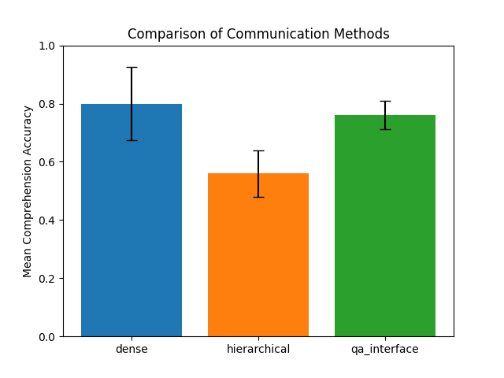

# Research Report: Effective Communication Strategies for AI

## 1. Executive Summary
This research investigated methods to improve the effectiveness of AI-to-human communication, specifically when conveying dense information. We hypothesized that structured formats (hierarchical summaries, Q&A interfaces) would improve a user's comprehension compared to traditional, monolithic dense summaries. Our experiment used a simulated user (an LLM) to measure comprehension accuracy and preference across three formats generated from news articles.

The key finding was a significant disconnect between user preference and task performance. The **Dense Summary** was the most effective format for comprehension accuracy (80%). The **Q&A Interface** performed nearly as well (76%), a non-statistically significant difference. However, the **Hierarchical Summary** was the most preferred format by the simulated user, despite yielding the lowest accuracy (56%), a statistically significant drop. This suggests that while users may prefer interfaces that feel more organized and less overwhelming, a simple, dense block of text remains highly effective for detail-oriented comprehension tasks.

## 2. Goal
- **Hypothesis:** Structured, non-linear communication methods (hierarchical summaries, Q&A interfaces) are more effective for conveying dense information from an AI to a human than a single, dense summary.
- **Importance:** As AI agents become more powerful, they process vast amounts of data. Presenting this information digestibly is crucial for user trust, verification, and utility. This research aims to provide empirical evidence to guide the design of more effective AI-human interfaces.
- **Expected Impact:** To inform developers of AI systems on how to structure information output for better human comprehension and satisfaction.

## 3. Data Construction

### Dataset Description
- **Source:** CNN/DailyMail Dataset, version 3.0.0, obtained from HuggingFace (`cnn_dailymail`).
- **Size and Characteristics:** The dataset contains over 300,000 news articles, each paired with a multi-sentence summary (highlights). We used the articles as the source of "dense information".
- **Selection:** We selected 5 articles from the 'test' split for our experiment to ensure a consistent and reproducible data source. These were saved in `artifacts/selected_articles.json`.

### Example Samples
An example article (`id: ee17dfb574feca82ccac5689595e47483bd23f12`) discusses the arrest of a 19-year-old in Britain on terror charges. The article is short but contains specific details (name, age, location, charges) that are good for testing comprehension.

### Data Quality
The dataset is a standard benchmark and is considered high quality. No preprocessing was required beyond selecting the articles.

## 4. Experiment Description

### Methodology
We employed a simulated user study. An LLM (`gpt-4o`) was used to generate three different communication "artifacts" from each source article. Then, a different LLM instance (`gpt-3.5-turbo`), acting as a "junior analyst", was tasked with answering 10 ground-truth questions about the article using only the information from one of the artifacts. A final LLM call (`gpt-3.5-turbo`) scored the analyst's answers for correctness.

**Communication Methods:**
1.  **Dense Summary (Baseline):** A single, comprehensive 400-500 word summary.
2.  **Hierarchical Summary:** A 1-sentence TL;DR with 5-7 expandable "nuggets" of information.
3.  **Q&A Interface:** A list of 5-7 key questions with their answers, generated from the article.

### Implementation Details
- **Tools:** Python 3.10, `openai`, `datasets`, `numpy`, `scipy`, `matplotlib`.
- **Models:** `gpt-4o` for generation, `gpt-3.5-turbo` for simulation and scoring.
- **Code:** All scripts are located in the `src/` directory.

### Experimental Protocol
- **Reproducibility:** The code is fully reproducible. It relies on a fixed set of 5 articles and uses a low temperature (0.2) for LLM generation to ensure consistency.
- **Evaluation Metrics:**
    - **Comprehension Accuracy:** The primary metric. Percentage of questions answered correctly by the simulated user.
    - **Simulated Preference:** A qualitative ranking of the three formats by an LLM simulating a user's preference.

### Raw Results
The raw scores and preferences are stored in `results/evaluation_results.json`.

#### Tables
| Method | Mean Accuracy | Std. Dev. |
|---|---|---|
| Dense Summary | 0.80 | 0.13 |
| Hierarchical | 0.56 | 0.08 |
| Q&A Interface | 0.76 | 0.05 |

#### Visualizations

## 5. Result Analysis

### Key Findings
1.  **Dense Is Best for Accuracy:** The traditional dense summary resulted in the highest comprehension accuracy (80%).
2.  **Q&A Is a Strong Contender:** The Q&A interface performed nearly as well as the dense summary (76%), and the difference was not statistically significant (p=0.541).
3.  **Hierarchy Hurts Accuracy:** The hierarchical summary led to a statistically significant drop in accuracy (56%, p=0.009).
4.  **Preference vs. Performance:** The simulated user strongly preferred the hierarchical method (14 preference points), even though it produced the worst results. The dense summary was second (11 points), and the Q&A interface was last (5 points).

### Interpretation
The results suggest that for a task requiring detailed comprehension, providing all the information upfront in a well-written dense block is most effective. The simulated user can scan and process this text efficiently.

The poor performance of the hierarchical method may stem from the two-step nature of the interaction. The "user" has to first identify a relevant headline and then "expand" it, which may be less efficient than simply searching a single block of text.

The strong performance of the Q&A interface is notable. It implies that if the AI can anticipate the user's questions, presenting the information in this format is a highly effective strategy that is almost as good as a full summary.

The most critical insight is the preference-performance paradox. Users may be drawn to interfaces that appear structured and less intimidating (like the hierarchical summary), but these interfaces may not be the most effective for the task at hand. This is a classic HCI finding and highlights the importance of testing beyond subjective preference.

### Limitations
- **Simulated User:** The core limitation is the use of an LLM to simulate a human user. While pragmatic, this doesn't capture the full complexity of human cognition, memory, and attention. The results reflect how an LLM processes information, not necessarily a human.
- **Small Sample Size:** The experiment was run on only 5 articles. A larger sample size would increase the statistical power of the results.
- **Task Specificity:** The task was question-answering. For other tasks, like getting a general gist or exploring a topic, the results might be different.

## 6. Conclusions

### Summary
The hypothesis that structured, non-linear formats would outperform a dense summary was not fully supported. For detailed comprehension, a dense summary remains a highly effective method. However, a pre-computed Q&A interface is a surprisingly strong alternative. Most importantly, we found that user preference does not always correlate with performance.

### Implications
- **Don't discount the simple summary:** A well-written, dense summary is a powerful tool for information transfer.
- **Consider a Q&A format:** If an AI can predict user needs, a Q&A interface can be an excellent, efficient alternative.
- **Test beyond preference:** User-preferred interfaces are not always the most effective. Both preference and performance should be measured.

## 7. Next Steps
- **Human Study:** The most obvious next step is to replicate this experiment with human participants to see if the preference-performance paradox holds.
- **Hybrid Interfaces:** Explore hybrid models, such as a dense summary with a Q&A sidebar, to combine the strengths of different formats.
- **Different Tasks:** Evaluate these communication methods on different tasks, such as creative brainstorming or exploratory search.
